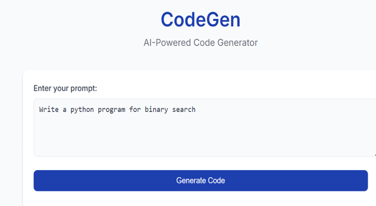
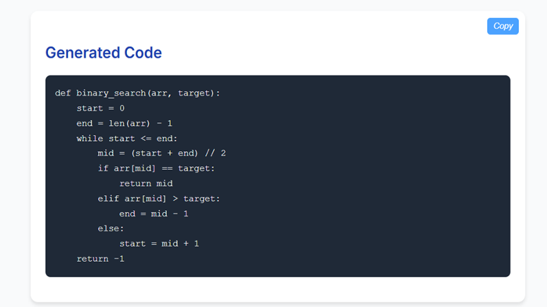

# CodeGenAI – Automated Code Generation System  

##  Introduction   
**CodeGenAI** is a web application that uses **fine-tuned transformer models (CodeT5 and BART)** to generate code from natural language prompts.  
It helps developers convert problem descriptions into working code efficiently using advanced deep learning techniques.  

It uses prompt engineering and fine-tuned models to automatically:  
- Understand user input (prompt)  
- Generate relevant code  
- Produce structured and readable output  
- Improve accuracy using trained datasets  
- Store generated results  

---

## What CodeGenAI Does   
1. **Prompt Understanding** – Interprets natural language input  
2. **Code Generation** – Generates code using fine-tuned CodeT5 and BART models  
3. **Structured Output** – Outputs clean and readable code  
4. **Model Fine-Tuning** – Enhances performance using custom datasets  
5. **Result Storage** – Saves generated outputs for reference  

---

## 🔹 Sample Outputs  

### Input Prompt  
  

### Generated Code  
  
