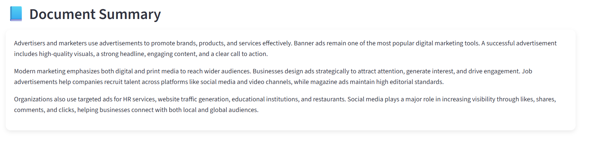
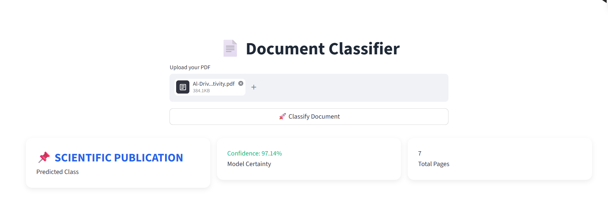
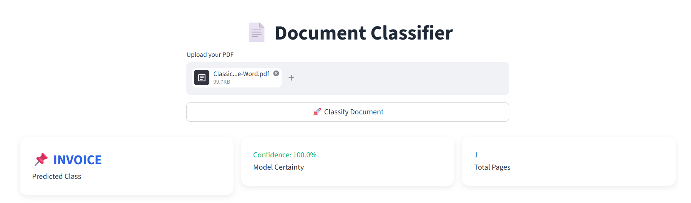

# Document Understanding   

##  Introduction   
**DocuSense** is a web application built with **Streamlit and Transformer-based Vision-Language Models** that helps users analyze and understand documents efficiently.  
It uses deep learning techniques to automatically:  
- Classify document types  
- Extract key information  
- Generate summaries  
- Provide structured outputs  

---

## What it Does   
1. **Document Classification** – Identifies document types such as Invoice, Resume, Scientific Publication, etc.  
2. **Content Extraction** – Extracts important information from document images  
3. **Summarization** – Generates concise summaries of document content  
4. **Multi-format Support** – Works with images and PDF documents  
5. **Accurate Processing** – Uses transformer models for better performance  

---
## Embeddings & FAISS Index  
The embeddings and FAISS index generated during the project are stored and available here:  
🔗 https://drive.google.com/drive/folders/120ApkMXuY033KxfYh-DQJ98lPTRrAbiV  

## Sample Webpages  

### Document Summarisation
  

###  Document Classification - Scientific Publication  
  

### Document Classification - Invoice 
  

