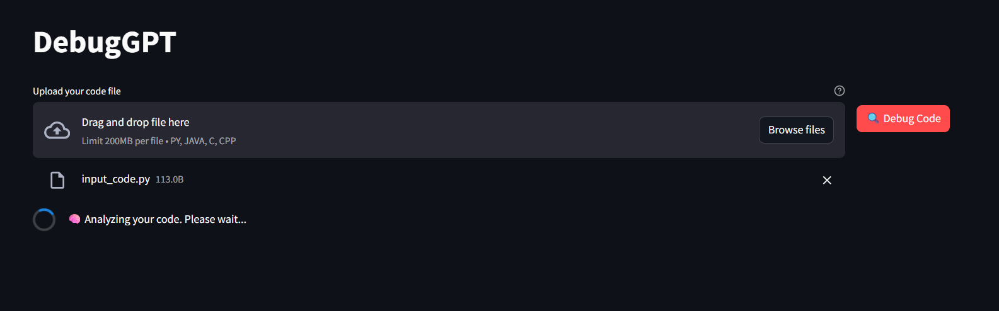
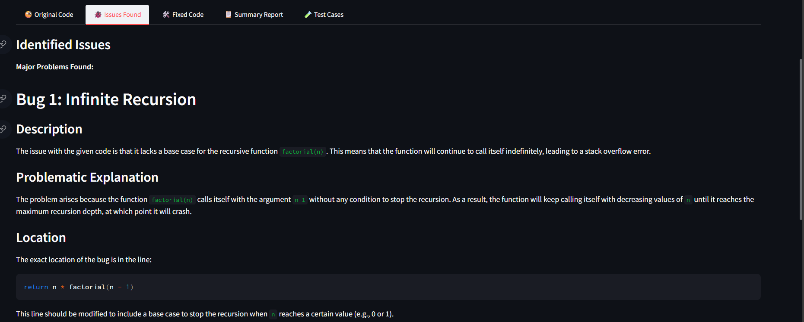
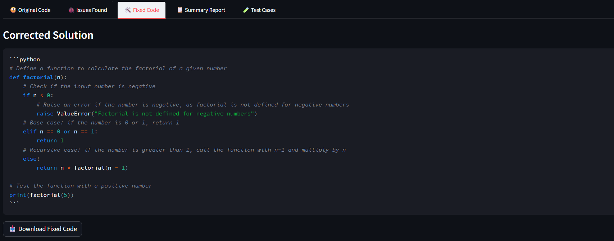

# DebugGPT – Automated Code Debugger   

##  Introduction   
**DebugGPT** is a web application built with **Streamlit, LangChain, and LangGraph** that helps developers debug their code faster and more efficiently.  
It uses prompt engineering and LLMs to automatically:  
- Detect bugs  
- Suggest fixes  
- Generate corrected code  
- Create reports  
- Produce test cases  

---

## What DebugGPT Does   
1. **Bug Detection** – Finds errors in Python, C, C++, and Java code   
2. **Fix Suggestions** – Explains the issues and provides solutions   
3. **Corrected Code** – Outputs a clean, working version of the code   
4. **Report Generation** – Summarizes bugs, fixes, and impacts   
5. **Test Case Generation** – Creates test cases (normal, edge, error cases)   

---

## 🔹 Sample Webpages  

### 🏠 Home Page  
  

### 🐞 Debugging Results  
  

### 📋 Fixed code
  
