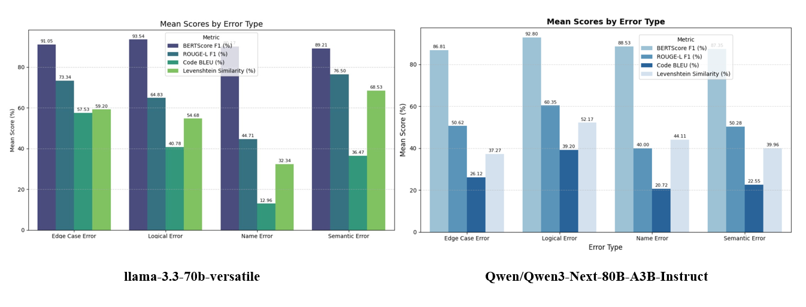
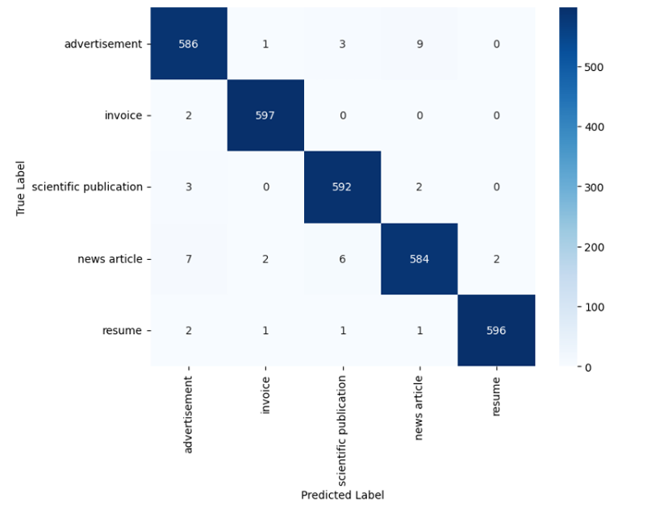
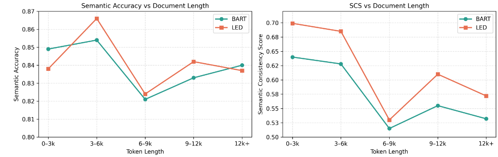

# Code Intelligence & Document Understanding  

##  Introduction  
This project presents an the following:  
- **Code Generation**  
- **Code Debugging**  
- **Document Understanding**  

It leverages **Transformer-based models (CodeT5, BART, LED, DiT, LLaMA)** to automate software development and document analysis tasks efficiently.

---

## Code Generation Results  

| Model   | BLEU Score | ROUGE Score | METEOR | BERTScore (F1) |
|--------|-----------|------------|--------|----------------|
| CodeT5 | 0.78      | 0.81       | 0.76   | 0.84           |
| BART   | 0.74      | 0.79       | 0.72   | 0.80           |

**Best Model: CodeT5**

---

## Code Debugging  

### Performance Graph  
  

---

## Document Understanding  

The system integrates **Document Classification + Summarization** using Vision and Language Transformers.

### Key Performance  
- Classification Accuracy: **~99%**  
- LED outperforms BART in summarization (higher semantic accuracy and layout fidelity) :contentReference[oaicite:1]{index=1}  

---

## Evaluation Results  

### Confusion Matrix  
  

### Classification Report   

| Document Class        | Precision | Recall | F1-score |
|----------------------|----------|--------|----------|
| Advertisement        | 0.98     | 0.98   | 0.98     |
| Invoice              | 0.99     | 1.00   | 0.99     |
| Scientific Publication | 0.98   | 0.99   | 0.99     |
| News Article         | 0.98     | 0.97   | 0.98     |
| Resume               | 1.00     | 0.99   | 0.99     |

**Overall Accuracy: 0.99**

### Model Evaluation Graph  
  

---

## Embeddings & FAISS Index  
Stored embeddings and FAISS index used in the system are available here:  
🔗 https://drive.google.com/drive/folders/120ApkMXuY033KxfYh-DQJ98lPTRrAbiV  

---

